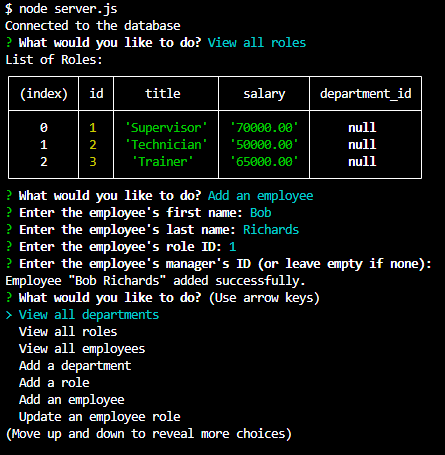

# Employee Tracker App
https://drive.google.com/file/d/19-r4UTHX51zl2kFqaVbUcWkKAf8m82YP/view?usp=sharing

## Description

A simple node-based application that allows you to track employees.

## Features

- User Menu
- View Departments, Roles, Employees
- Add Departments, Roles, Employees
- Update Roles

## Technologies Used

- JavaScript
- Node.js
- Inquirer
- SQL

## How to Use

Run 'node server.js' and follow the prompts.

## Installation

Clone the repo to run locally.

## License

This project is licensed under the [MIT License](https://opensource.org/license/mit/).
